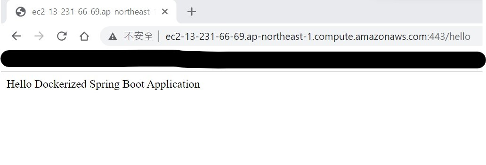

# springboot-docker-demo
A basic Kotlin SpringBoot app that uses Docker. 
After starting the app, a message will be displayed at `localhost:8080/hello`

Instructions on how to deploy this image to AWS are also included.

## Docker commands for using app locally 
`docker build -t sb-docker-demo .`

`docker run -p 8080:8080 sb-docker-demo` 

# How to use this Docker image on AWS   
## Push the image onto AWS ECR
1. Upload this code onto your source (e.g Github, CodeCommit, S3)
2. Create an ECR repository in your AWS account (No special settings needed)
3. Create a CodeBuild project on the AWS console, using standard settings and also setting environment variables. (The cli is even more hassle)
   Select the Source you chose in step 1.
   https://docs.aws.amazon.com/codebuild/latest/userguide/sample-docker.html
4. Create a new IAM policy with the following statement. Attach this policy to the service role you gave the Codebuild project in Step 3.
   {
   "Action": [
   "ecr:BatchCheckLayerAvailability",
   "ecr:CompleteLayerUpload",
   "ecr:GetAuthorizationToken",
   "ecr:InitiateLayerUpload",
   "ecr:PutImage",
   "ecr:UploadLayerPart"
   ],
   "Resource": "*",
   "Effect": "Allow"
   }
   
5. Run the CodeBuild project, and the image will be created in ECR!  

## Deploying the ECR image onto EC2 and serve it on the web
1. Create an ec2 instance 
2. ssh onto it 
3. Install docker
4. Start docker `sudo service docker start`
5. Pull the ecr image into the ec2
   `aws ecr get-login-password --region ap-northeast-1 | sudo docker login --username AWS --password-stdin <account_id>.dkr.ecr.ap-northeast-1.amazonaws.com`
   `docker pull ${aws_account_id}.dkr.ecr.${region}.amazonaws.com/${hello-repository}:latest`
6. `docker run -p 443:8080 image-name` 
7. Go to the instance's "${Public IPv4 DNS}/hello" and see the API being served!

##  Deploying the ECR image onto EKS or ECS
TBD
